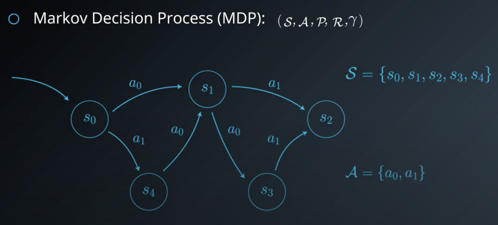
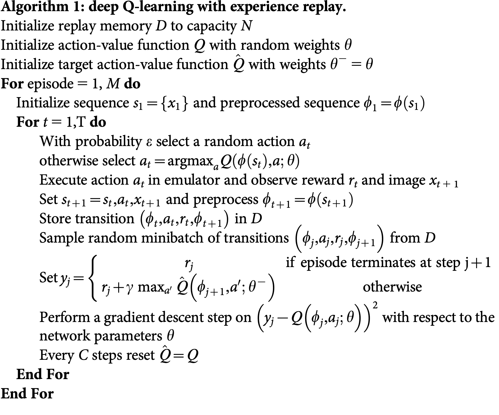
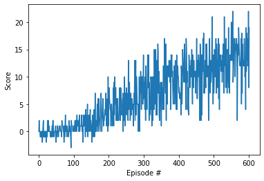

# Final Report for Project 1 - Navigation of the Banana Environment using Deep Q-Networks (DQNs)

## Introduction

In this report, we discuss the learning algorithm for an agent to automatically navigate the world of bananas where the objective is to collect as many yellow bananas as possible while avoiding the blue bananas.  Yellow bananas get a +1 reward while blue bananas get a -1 reward.  For a more complete exposition of this environment, please see the `README.md` file in the same directory as where this report is located.  We also show results and further extensions on how to improve the agent's performance.

## Review of the Reinforcement Learning Problem and the Learning Algorithm

The learning algorithm used for driving the agent to maximise the rewards sought are using Deep Q-Networks (DQNs).  DQNs are the deep learning approach to solving the reinforcement learning (RL) problem.  The RL problem is to train an agent to interact with an unknown environment where we observe the "state" of the environment, then interact with the environment by performing an action.  We continually interact with the environment by performing actions, then examining what the state is after the action.  Additionally, after we examine the state there may additionally be a reward that follows.  A state examination and action interaction is defined as a timestep.  The goal is thus to derive a set of actions given the unknown environment to maximise the reward gained as we interact with the environment.  This set of actions is known as the optimal policy.  RL problems are typically framed as Markov Decision Processes (MDPs).  An MDP consists of a set of states `S` and actions `A` along with probabilities `P`, rewards `R` and a discount factor `gamma`.  The figure below is a pictorial example of a MDP.  Here we have five states and two actions.  At each state, we have a set of possible actions that we can take which will get us to another state and yield a reward if it is possible.  As additional constraints, each action has a certain probability assigned to it so it is not deterministic on which action we would take given a state.  We transition to different states in this graph depending on what actions we take and the probabilities given for each action until we declare that the interaction has finished.  These are what are known as episodic RL problems.  For this banana problem, 300 timesteps are used to declare a single episode.



The probabilities `P` captures how frequently different transitions and rewards occur, often modelled as a single joint probability where the state and reward at any timestep `t+1` depend on only the state and action taken at time `t`.  In other words, P(S<sub>t+1</sub>, R<sub>t+1</sub> | S<sub>t</sub>, A<sub>t</sub>).  This property is known as the Markov property.  There are two quantities we are typically interested in: The value of a state or *value function*, `V(S)` and the value of an action in a certain state `Q(S,A)` or *action-value function* which can help us decide what action to take.  `V(S)` tells us what the expected reward would be if we are in the state `S` and if we followed the optimal policy to the end of the episode.  `Q(S,A)` gives us more information where it tells us what the expected reward would be if we are in the state `S` *and* if we took the action `A` in this state, then followed the optimal policy to the end of the episode.  These two mappings are very much interrelated and help us find an optimal policy that maximises the total reward received.  Note that because MDPs are probabilistic in nature, we can't predict with complete certainty what future rewards we will get and for how long.  Therefore, we typically aim for the total *expected* reward.  This is where the discount factor `gamma` comes into play as well.  It is used to assign a lower weight to future rewards when computing state and action values.

RL algorithms are typically grouped into two categories: The first is model-based approaches such as Policy Iteration and Value Iteration require a known transition and reward model.  They essentially apply Dynamic Programming to iteratively compute the desired value functions and optimal policies using that model.  The second is model-free approaches such as Monte Carlo methods and Temporal Difference algorithms don't require an explicit model.  They sample the environment by carrying out exploratory actions and use the experience gained to directly estimate the value functions.  For DQNs, this is a model-free approach where we use a neural network to estimate what the action function or `Q` function is to allow us to measure the expected reward given a state and the corresponding action, following the optimal policy to the end of the episode.  Specifically, given the current state of the environment, we use a deep neural network to provide a probability distribution of all actions we should take given the current state so that the expected reward is maximised.  In RL parlance, the elements in the action-value function `Q(S,A)` are known as action-values which implies that given a state `S` selected **from the beginning** of the episode and a corresponding action chosen, we estimate the expected reward. However, **target-values** are a recursive definition which is defined as the reward seen immediately at the state `S` at timestep `t` followed by the expected reward would be by taking best action at timestep `t`.  The expected reward that follows with the best action is weighted by the discount factor `gamma` to allow for gradual decreases in future rewards and to concentrate on the rewards obtained currently.

The main DQN algorithm is from Volodymyr Mnih *et al.* from their paper in *Nature* [1].  It is shown below for reference.  Take note that we deviate from the algorithm below slightly for stability purposes which we will outline later.



Before we dive into the algorithm, there are some key concepts we need to explore first.  We define a *transition* to be the observed state, the action we take, the reward seen at the next state after we take the action at any timestep `t`.  In other words, we define a tuple of (S<sub>t</sub>, A<sub>t</sub>, R<sub>t</sub>, S<sub>t+1</sub>) as a transition.  First the concept of *replay memory* in the algorithm is where we remember the most recent `N` transitions. &#x03A6;(S) is defined as a pre-processing function that is applied to the input state from the environment so that it's in the right form to be processed by the neural network.  Finally, &#x03B8; are the parameters for a neural network that need to be learned to estimate the `Q` function.  With this, the purpose of this replay memory is to implement what is known as *experience replay* so that when we update the weights to the neural network, we select a batch of samples randomly selected from this replay memory as updating the weights with consecutive states contained within a batch would be highly correlated and so the network would essentially not learn anything.  Also take note that there are two neural networks that are defined for this process.  The first network is the *local* action-value function while the second network is the *target* action-value function.  If we didn't have the two networks and only had one network, there would be correlation experienced between the target-values being estimated and the parameters we are changing.  This is akin to a "moving target" and is harder to optimise.  Instead, we **fix** the neural network parameters to generate target-values needed for properly estimating the `Q` function so that they don't change for a certain number of iterations.  This can be achieved by using a second neural network to hold a copy of these weights while we optimise the first neural network to learn the underlying `Q` function.  After a certain number of iterations, we can update the second neural network with the first neural network and repeat the process. 

We now explain the above algorithm.  We initialise the replay memory `D` to be of size `N` as well as the two neural networks that will estimate the `Q` or action-value function.  The number of input neurons is the total number of features that are observed for a single state while the number of output neurons is the total number of actions available to take.  Take note that both networks are both initialised to have the same weights at random.  We run over `M` episodes and within each episode, and at the beginning of an episode we observe the first state of the environment and also store its preprocessed form.  For each time step, we select a random action with probability &#x03B5;, otherwise we forward the current state into the **local** neural network and choose the action that is the most likely by analysing whichever output neuron gives the highest response.  This method of randomly choose an action or the most likely action with probability &#x03B5; is what is known as the &#x03B5;-greedy policy.  Once we choose an action, we interact with the envrionment and examine what the reward is well as what the next state is.  We also pre-process the state to produce both the original state S<sub>t+1</sub> and &#x03A6;(S<sub>t+1</sub>).  We create a transition using both the *pre-processed* state at the current timestep `t` and `t+1`, the action taken at timestep `t` and the observed reward at timestep `t` and commit it to the replay memory `D`.  We also choose an interval `C` such that when `C` timesteps pass and as long as we have a sufficient number of transitions in the replay memory (i.e. we have at least as many as we set for the batch size in updating the neural network parameters), we then sample from the replay memory to obtain a randomly acquired batch of transitions.  What is different in this approach versus what is explained in the figure above is that in the original DQN framework, the sampling of transitions is done at every timestep in the episode where we opt to do it at every multiple of `C` timesteps.  The reason why we do this will become clear later.

We then calculate what the expected reward would be by using the **target** network for each transition in the batch where it is simply the reward encountered at this transition if the episode terminates or we take the current reward as well as what the expected reward would be by using the next state from the transition and using the target network to obtain the action that produces the largest score, then discounting it by a factor of `gamma`.  We then take these expected rewards and calculate what the errors are with the expected rewards of the **local** network then perform a gradient descent update to change the weights of the local network.  We will call these errors the **residuals**.  What is different at the end of this is how we "reset" the target network.  In the original framework, the target network is simply replaced by the local network at every `C` steps.  For this implementation, we opt to do a "soft" update instead where for every weight between the local and target neural networks, we replace the target network parameters with a weighted exponential update: `θ_target = τ*θ_local + (1 - τ)*θ_target` with `τ` being a small number.  The purpose behind this soft update is so that the changes from the local network can slowly be introduced into the target network rather than having the target network abruptly change its weights to be of the local network.  This essentially makes the training more stable.  Therefore, for each episode we iterate over as many timesteps needed until we declare the episode to be over, committing transitions to memory, choosing the best actions for the current `Q` function by using the local neural network then at every `C` timesteps, we do a soft update of the target neural network using the local neural network's changes.

## DQN Architecture

In the original DQN architecture, the authors directly used raw pixel data and so a combination of convolutional and fully-connected layers were used.  Because the state vector for this problem is a 37-dimensional vector, fully-connected layers were used instead.  There were three fully-connected layers with 150 neurons, 120 neurons and finally 4 output neurons that represent the actions required for interacting with the environment.  What is additionally implemented is batch normalisation after each fully connected-layer and before the activation function to help centre the data so that the model can be trained easier.  We also opted to use ReLU activation functions as seen in the original paper with no activation function applied to the last layer (i.e. a linear layer) as these are to reflect the actual `Q` function values given an input state.  For the hyperparameters chosen, we simply used the ones given in the DQN exercise that was part of the Udacity Deep Reinforcement Learning Nanodegree program which was used for the `LunarLander-v2` environment from OpenAI gym that was suitable for that task at hand and for a first step we just used those same parameters which ended up working well.  The additional hyperparameters we chose were:

## Hyperparameters
| Parameter | Value   |
|---|---|
| Buffer Size `D`  | 100000  |
| Batch Size | 64 |
| `gamma` | 0.99 |
| `τ` | 0.001 |
| Update Interval `C` | 4 |
| Optimiser | Adam with default `beta1` and `beta2` settings |
| Learning Rate | 0.0005 |
| Loss Function | MSE Loss |

Note that we additional anneal the probability &#x03B5; at each episode so that we promote choosing the most likely action as we further progress through the episodes.  The basis for this is that we would hope that as we are exposed to more episodes, the underlying `Q` function will become more accurate so we should rely on using the `Q` function more for choosing the most optimal action rather than relying on random chance.  However, the random chance element at the beginning is crucial as we have absolutely no information about the environment and the nature of the states.  We start off with a probability of &#x03B5;=1.0, then as each episode happens we multiply the probability by a decay factor of 0.995 and continue to decay the probability until we hit a minimum probability of 0.01 which is maintained for the rest of the episodes.

## Results

For the learning task to be deemed successful, we must achieve at least an average reward of +13 over 100 episodes.  In other words, we look at the 100 most recent episodes and we stop learning if the average reward over these 100 most recent episodes is +13 or more.  The table below illustrates the evolution of the episodes as well as the average score obtained every 100 episodes: The
```
Episode 100 - Average Score: 0.08
Episode 200 - Average Score: 2.04
Episode 300 - Average Score: 5.41
Episode 400 - Average Score: 8.56
Episode 500 - Average Score: 10.38
Episode 600 - Average Score: 12.93
Episode 602 - Average Score: 13.04
Environment solved in 502 episodes!	Average Score: 13.04
```

At the 602nd episode, we managed to find a solution that gave us an average score of ~13, meaning that we solved the environment in 502 episodes.  The figure below shows the rewards trajectory where the horizontal axis is the episode and the vertical axis is the reward assigned for that episode



## Ideas for Future Work

There are two ideas we can use to further improve the performance of the DQN algorithm as shown above.

### Prioritized Experience Replay
Deep Q-Learning samples experience transitions uniformly from a replay memory.  Prioritized experienced replay is based on the idea that the agent can learn more effectively from some transitions than from others, and the more important transitions should be sampled with higher probability.  Essentially, we should weight the transitions in our replay memory such that they are directly proportional to the residuals calculated within a batch of transitions.  These residuals are called priorities, and we also add these priorities to a transition which then gets committed to the replay memory.  Within the replay memory, we normalise the priorities and thus use these normalised priorities to help sample what the transitions would be within a batch.  However, because this becomes a non-uniform sampling of transitions and no longer matches the underlying distribution they came from so the actual probabilities and how they contribute to the weight updates of the network need to change to reflect this.  You can read the paper for more details [2].

### Dueling DQN
Currently, in order to determine which states are (or are not) valuable, we have to estimate the corresponding action values for each action. However, by replacing the traditional Deep Q-Network (DQN) architecture with a dueling architecture, we can assess the value of each state, without having to learn the effect of each action.  The core idea of using Dueling DQNs is to have two streams - one that estimates the state values `V(s)` and one that estimates the advantage values `A(s,a)`.  In the context of this project, both networks share the first few fully-connected layers, but then branch off with separate fully-connected layers afterwards to estimate their respective quantities.  Finally, the `Q` function is estimated by simply adding the two quantities together.  The intuition behind this is that most states don't vary a lot across actions so it makes sense to estimate the state values directly and have the advantage values simply offset the state values depending on the state and action at a current timestep to finally estimate the `Q` function.  Some modifications are needed to adapt Q-learning to this architecture so you can review the paper for more details [3].

## References
1. Volodymyr Mnih *et al.* - "Human-level control through deep reinforcement learning".  **Nature**, Vol. 518, pp. 529-533, 2015 - https://doi.org/10.1038/nature14236
2. Tom Schaul *et al.* - "Prioritized Experience Replay".  **arXiv**, https://arxiv.org/abs/1511.05952 - Retrieved on July 14, 2020
3. Ziyu Wang *et al.* - "Dueling Network Architectures for Deep Reinforcement Learning".  **arXiv**, https://arxiv.org/abs/1511.06581 - Retrieved on July 14, 2020