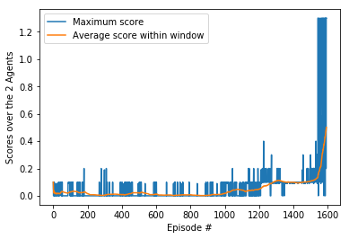

# Final Report for Project 3 - Solving the Tennis Environment using a Deep Deterministic Policy Gradient (DDPG) Actor-Critic Paradigm

## Introduction

In this report, we discuss the learning algorithm for an Actor-Critic system to
automatically solve the Tennis environment provided by Unity.  In this
environment, two agents control rackets to bounce a ball over a net. If an agent
hits the ball over the net, it receives a reward of +0.1.  If an agent lets a
ball hit the ground or hits the ball out of bounds, it receives a reward of
-0.01.  Thus, the goal of each agent is to keep the ball in play.  The
observation space consists of 8 variables corresponding to the position and
velocity of the ball and racket. Each agent receives its own, local observation.
Two continuous actions are available, corresponding to movement toward (or away
from) the net, and jumping.  We call this the *action* space.  Every entry in
the action vector should be a number between -1 and 1.  For a more complete
exposition of this environment, please see the `README.md` file in the same
directory where this report is located.  We also show results and discuss
further extensions on how to improve this system's performance.

## Review - Policy Gradient Methods

Before we dive into the DDPG algorithm, it is important that we discuss what
policy gradient methods are, as DDPG is derived from this space.  Policy
gradient methods are ubiquitous in model-free reinforcement learning algorithms.
The policy gradient method is also the "Actor" part in Actor-Critic methods (of
course more on this later).  In essence, policy gradient methods update the
probability distribution of actions that an agent should take in an environment
given its current state so that actions with a higher expected reward have a
higher probability for this observed state.  We will first assume a discrete
action space and a stochastic (i.e. non-deterministic) policy in this section.

First, let us define the concept of a *trajectory*, shown below:


The trajectory &tau; of an episode is defined as pairs of observed states and
corresponding actions to take in these states (s<sub>t</sub>, a<sub>t</sub>)
from the beginning of the episode at timestamp `t=0` (s<sub>0</sub>,
a<sub>0</sub>) up to the end at timestamp `t=H` (s<sub>H</sub>, a<sub>H</sub>).
The definition of an episode in this case is the set of actions we take from
`t=0` to `t=H`.  Note that we also observe the state of the environment
s<sub>H+1</sub> but we only observe it.  Because the episode terminates our
interaction with the environment, we do not act on this state.  In a similar
fashion, we define the total reward obtained in the episode is defined as
R(&tau;) which is simply the sum of the rewards.  Note the notation that given
the state s<sub>t</sub> and the corresponding action a<sub>t</sub> we make, we
obtain the reward given by r<sub>t+1</sub> as this represents the next stage of
the interaction *and* the corresponding next observed state s<sub>t+1</sub>.
Because we are now dealing with stochastic environments, we should define the
**expected** return of the environment.  Specifically, we want to learn a
function that will help maximise the total expected reward of the environment
that is parameterised by &theta;.  Let us define the function U(&theta;) that
provides the expected return of the environment given the parameters &theta;.


This makes sense as we are computing a weighted average of rewards over all
possible trajectories where the weight is given by the probability of a
trajectory occurring within the environment.  Since we want to maximise the
expected reward of the environment given a model that is parameterised by
&theta;, we should **maximise** the function U(&theta;) and to do that we can
perform gradient ascent.  To do that, we start with some initial parameters,
then compute the gradient of U(&theta;) evaluated at this point.  We then
perform incremental updates to the parameters by observing te gradient as it is
in the direction of the maximum and adding a weighted version of it to the
parameters.  We keep repeating this until we see very little change or when a
maximum number of iterations has occurred.  Finding the optimal parameters
through gradient ascent is known as the REINFORCE algorithm.  Below is a summary
of how to perform the algorithm.  If you would like to see how the gradient is
derived, I will encourage you to consult [1].


To provide a better intuition on the notation,
&pi;<sub>&theta;</sub>(a<sub>t</sub><sup>(i)</sup> |
s<sub>t</sub><sup>(i)</sup>) is the probability that action a<sub>t</sub> will
be taken, given the state s<sub>t</sub> within the trajectory `i`,
&tau;<sup>(i)</sup>.  The reward given for the trajectory `i` is
R(&tau;<sup>(i)</sup>).  Note that this probability is provided by a model
**parameterised** by the parameters &theta;.  In other words,
&pi;<sub>&theta;</sub> is the policy that provides a probability distribution of
the actions we need to take given the observed states and this policy is a
function that is parameterised by &theta;.  As this expected return for the environment is also
parameterised by &theta;, we additionally need to calculate the gradient of the
expected return as this is what we need to perform gradient ascent.  This is what is defined as the
**policy gradient**.  Therefore,
the gradient of this function is denoted as &nabla;<sub>&theta;</sub>U(&theta;).
If you go through the derivation, interestingly the gradient of the expected
return is directly proportional to take the gradient of the natural logarithm of
the policy defining the actions we take that are parameterised by &theta;.  In
other words, we collect `m` trajectories that serve as a "mini-batch" of
examples, then with a maximum number of timesteps enforced, or the horizon `H`,
for each trajectory we compute the gradient of the policy evaluated for each
state-action pair and scale this by the reward received for the corresponding
trajectory.  We take the average of all of these to find the final gradient
which we use to update our parameters for the expected reward function.
Combined with a learning rate &alpha;, we simply scale the gradient and this on
top of the parameters until convergence.

What is extremely nice about this method is that we can model the policy as a
**neural network** where the goal would be to learn the optimal probability
distributions of the actions to take given the observed states by simply using a
neural network.  By defining the right architecture, finding the optimal
parameters is indeed well defined and can efficiently be found by
backpropagation.  The reader should be aware that this is still in the context
of *model-free* as we don't care about how we are modelling the dynamics of the
environment.  We are replacing our knowledge of the environment by attempting to
replace it with a neural network of a suitable architecture that can help us
bridge the gap between the interaction with the environment and the optimal
probability distributions of actions to take given the observed states.

## The Actor-Critic Method

Though the REINFORCE algorithm is promising, there are some glaring issues with
the algorithm that renders the method unstable.  In particular, we have noisy
gradients and high variance.  Recalling the REINFORCE algorithm above, we update
the policy through Monte Carlo updates as we are sampling `m` trajectories where
the trajectories are all generated at random.  This unfortunately introduces
high variability because each trajectory sampled during training can deviate
from each other at greatly.  Because of the high variability, this will make
noisy gradients and cause unstable learning.  In addition, the distribution
generated by the policy could be skewed thus providing a non-optimal solution.

Another problem with the REINFORCE method is if there are trajectories where the
cumulative reward at the end of the episode is 0.  There may have been some good
actions taken within the trajectory, but then get unfairly penalised when the
reward at the end of the episode is 0.  If the reward is 0, there is no gradient
provided and thus no updates would take place.  The essence of the policy
gradient is to increase the probabilities of taking good actions while
decreasing the probabilities of taking bad actions.  Both good and bad actions
will not be learned if the cumulative reward at the end of an episode is 0.
Because of these two issues, the REINFORCE method is unstable and is slow to
converge.  To overcome these shortcomings, we can reformulate the REINFORCE
method a different way and that is through the use of Credit Assignment.

### Credit Assignment

Let's take a look at the gradient of the expected reward function U(&theta;)
for one trajectory for the moment.  We know that R(&tau;) is the total reward
received at the end of the episode for this trajectory:


Let's examine the above equation carefully.  Even before an action is decided,
we have already received all of the rewards from the start up until time `t-1`.
In this case, we can think of the reward gained up to that point to be the
**past reward**.  From time step `t` and onwards, that would be considered the
**future reward**.  Specifically:


Because the trajectory is sampled at random from the environment, the action at
time step `t` can only affect the future reward, so the past reward should not
be contributing to the policy gradient.  Therefore, to properly assign **credit**
to the action a<sub>t</sub>, we should ignore the past reward.  Therefore, a
better policy gradient would be to change the reward over the whole trajectory
to just the future reward.


We normally discount the rewards at each time step with a scale factor &gamma;,
so we can replace the future reward with:


### Reformulating the Policy Gradient

We can now represent the gradient of the expected reward to be the following by
replacing R(&tau;) with G<sub>t</sub>.  Also to properly represent the
statistics, let's use probability notation:


We can then decompose the expectation into:


The right-most term is essentially the Q-function: Q(s<sub>t</sub>,
a<sub>t</sub>) which is the expected reward achieved given the current state
s<sub>t</sub>, the corresponding action we should take a<sub>t</sub> and the
states observed and the actions that follow by following the policy.  We will
preface this function with Q<sub>w</sub>(s<sub>t</sub>, a<sub>t</sub>) as
this function will essentially be learned by a neural network with parameters
`w`.  By substituting this into the previous equation, we get:


The above lead us to **Actor-Critic** methods where:

1. The "Critic" estimates the value function.  In this case, this would be the
   Q<sub>w</sub> function seen above.
2. The "Actor" updates the policy distribution in the direction suggested by the
   "Critic", such as the policy gradients we discussed above.

Both the Actor and Critic are parameterised with neural networks.  In the above
formulation, this formulation is known as the **Q Actor-Critic**.  If you'd like
to learn more about these, please consult [2].  The above formulation is what
is exactly used in the DDPG algorithm, which we will describe next.

## Review of the Deep Deterministic Policy Gradient (DDPG) Actor-Critic Paradigm

The learning algorithm used for solving the Reacher environment is using the
Deep Deterministic Policy Gradient (DDPG) Actor-Critic paradigm.  DDPG is also a
deep learning approach to solving the reinforcement learning (RL) problem.  In
comparison to DQNs where we are solving for the optimal Q-function to help drive
the decisions made to maximise a reward, DDPG is a policy function estimation
algorithm where we directly estimate the values required in the action space to
drive the agent and perform the best actions to maximise the total reward.  Like
DQNs, DDPG is also a model-free algorithm where the optimal actions we need to
take are driven by a deep neural network.  The main advantage of DDPG is that it
can be used for learning policies in high-dimensional *continuous* action
spaces.  In fact, the DDPG is essentially replacing the underlying mechanism of
estimating the optimal policy in the original Deterministic Policy Gradient
(DPG) algorithm with a deep neural network, hence the *Deep* in its name.

The DDPG algorithm is from Timothy Lillicrap *et al.* from their paper in *ICLR
2016* [3].  It is shown below for reference.  Take note that we will make some
slight modifications to the algorithm in order to accommodate for multiple
agents (2 of them) and change the way we perform our updates to the neural networks.


You will immediately notice that there are similarities between this algorithm
and the DQN algorithm by Volodymyr Mnih *et al.*.  In particular, we have both
local and target neural networks for both Actor and Critic.  There is also a
Replay Buffer that functions in the same was as the DQN.  For each episode, we
first decide on a random noise process that allow us to perturb the output
actions so that we can further explore the action space and to hopefully
generalise solving the environment.  In this paper as well as this project, we
use Ornstein-Uhlenbeck process as it models the velocity of a Brownian particle
with friction.  This results in temporally correlated values centered around 0.
We then examine the initial state of the environment.  Until the end of the
episode, we examine the environment and obtain the state s<sub>t</sub>.  Next,
we use the local Actor network and send s<sub>t</sub> through it to obtain the
corresponding actions a<sub>t</sub> produced from the network and add noise to
it as necessary.

Next, we use the actions a<sub>t</sub> and interact with the environment to
obtain the reward r<sub>t</sub> as well as the next state s<sub>t+1</sub>.  We
store the *transition* tuple (s<sub>t</sub>, a<sub>t</sub>, r<sub>t</sub>,
s<sub>t+1</sub>) in the Replay Buffer.  In the original paper, at each iteration
in the episode we sample a random mini-batch of transitions in the Replay Buffer
then calculate that the TD estimate of the cumulative reward for every sample
within the mini-batch which is calculated as y<sub>i</sub> where `i` is the
index of a transition within the mini-batch.  Specifically, we will first
calculate what the next actions would be a<sub>t+1</sub> by using the target
Actor network for the transitions in the mini-batch where we use the next states
and corresponding next actions to calculate what the expected return would be by
using the target Critic network which currently holds the best estimate of the
Q-function. 

To properly incorporate both the states and actions into the Critic neural network, the
current states in the mini-batch are forward propagated through the first hidden
layer, then after the activation function the actions then get concatenated to
this output where we then proceed to forward propagate information through the
whole network arriving at the final output layer which is a simple Linear
activation function as we are directly estimating Q-function values of the
environment.  We then use this output Q-function value, scale by the discount
factor &gamma; and add to this the current reward for each transition in the
mini-batch.  These are denoted as the **target** Q-function values.

To update the Critic neural network, we also calculate what the **expected**
Q-function values are by sending the current states and actions within the
mini-batch to the local Critic network, then minimise the mean squared error
between the two sets of quantities.  The parameters to be updated are from the
Critic neural network.  As suggested by the benchmark implementation for this
project, gradient clipping on the Critic network should be employed.  In this
case, we set the clipping value to be 1.

Finally, we want to also update the Actor network and in this case it would be
the local version of the network.  To do this, we must update the Actor network
by gradient ascent through the policy gradient approach.  In this case, we use
the Actor neural network to estimate what the best actions to take would be
given the current states provided in the mini-batch of transitions then use the
current states and best actions to calculate what the corresponding Q-function
values would be.  We then take the gradient evaluated at the current set of
parameters for the Critic network and perform a gradient ascent update.  Also
notice that we are performing soft updates so that target networks eventually
become the local networks where this strategy was discussed in the DQN project.

## Multiple Agents

Take note that the original DDPG algorithm assumes only one agent interacting
with the environment.  We have two agents here, each with their own copy of the
environment.  The way the Unity environment handles this is that when the states
are observed, this produces a two-dimensional matrix where each row is the state
observed by that agent and is independent with respect to the other agents.
Therefore, each row can be added to the Replay Buffer independently.
Specifically, to accommodate for the multiple agents, we simply allow them all
to add their own transitions to the Replay Buffer at each iteration.  Therefore
at each iteration, two transitions get independently added.  What is nice about
this is that each agent adds their experiences to the Replay Buffer and the
Actor and Critic networks incorporate this information in order to update their
weights.  Additionally, and as taken from the previous project what is
different about the update step is that instead of updating the weights after
every iteration, we perform 20 update steps every 40 timestamps.  This seems to
make learning more stable.  The previous project had 10 update steps every 20
timestamps, but this seemed to have produce agents that did not converge so the
decision here was to allow more transitions to be captured thus increasing the
chance of creating transitions that have better rewards before updating the
neural network parameters for the Actor and Critic.

## DDPG Architectures

In the original DDPG paper, this problem would be considered "low-dimensional",
so only fully-connected layers are used so we directly used the state vectors to
feed into the Actor and Critic networks.  Specifically, there are three
fully-connected layers in this architecture with 600 neurons, 400 neurons and 
finally 2 output neurons that represent the actions required for interacting
with the environment.  What is additionally implemented is batch normalisation
after each fully connected-layer, before the activation function to help centre
the data so that the model can be trained easier.  We also opted to use ReLU
activation functions as seen in the original paper with no activation function
applied to the last layer for the Critic network (i.e. a linear layer) as these
are to reflect the actual `Q` function values given an input state.  However for
the Actor network, the output action values are expected to be within the
`[-1,1]` range, so we opt to use a hyperbolic tangent activation function here
instead.  As recommended in the paper, the weights are initialised using a
uniform distribution of range `[-1.0 / sqrt(n), 1.0 / sqrt(n)]` with `n` being
the total number of input neurons into a layer, except for the last layer where
the weights are initialised within the `[-3e-3, 3e-3]` range.

## Hyperparameters

For the hyperparameters chosen, we defer to the default parameters chosen from
the paper with the exception of the batch size, as well as the hidden layer
sizes or the Actor and Critic networks.  They were originally 400 and 300 for
the first and second hidden layers, but we opted to increase the amount due to
the more complex task of learning to play tennis.  Specifically, they are the following:
| Parameter | Value   |
|---|---|
| Buffer Size `R`  | 100000  |
| Batch Size | 128 |
| `gamma` | 0.99 |
| `τ` | 0.001 |
| Actor Learning Rate | 10<sup>-4</sup> |
| Critic Learning Rate | 10<sup>-3</sup> |
| Optimisers | Adam with default `beta1` and `beta2` settings |

Recall that updating the Critic parameters are for the local version of it and
we are using the mean squared error loss to do so.  For the Actor parameters, we
also update the local version but use the definition of the policy gradient to
maximise the expected return.  Because PyTorch optimises via gradient descent,
we simply negate the gradient to perform an ascent step.

## Results

For the learning task to be deemed successful, we must achieve at least an
average reward of +0.5 over 100 episodes.  At each episode, we sum up the
rewards accumulated by both agents independently and assign the largest reward
between the two as the final reward for the episode.  Using these maximum
rewards, we must achieve an average maximum reward of +0.5 over the last 100
episodes.The table below illustrates the evolution of the episodes as well as
the average score within this window and the reward (the maximum score) at the
end of each episode.  We show this in 100 episode intervals:

```
Episode 100	# of timesteps needed: 30	Max Score: 0.09	  Average Score in Window: 0.03
Episode 200	# of timesteps needed: 15	Max Score: 0.00	  Average Score in Window: 0.02
Episode 300	# of timesteps needed: 15	Max Score: 0.00	  Average Score in Window: 0.01
Episode 400	# of timesteps needed: 15	Max Score: 0.00	  Average Score in Window: 0.01
Episode 500	# of timesteps needed: 15	Max Score: 0.00	  Average Score in Window: 0.02
Episode 600	# of timesteps needed: 15	Max Score: 0.00	  Average Score in Window: 0.01
Episode 700	# of timesteps needed: 15	Max Score: 0.00	  Average Score in Window: 0.00
Episode 800	# of timesteps needed: 15	Max Score: 0.00	  Average Score in Window: 0.01
Episode 900	# of timesteps needed: 16	Max Score: 0.00	  Average Score in Window: 0.00
Episode 1000	# of timesteps needed: 31	Max Score: 0.10	  Average Score in Window: 0.02
Episode 1100	# of timesteps needed: 30	Max Score: 0.09	  Average Score in Window: 0.04
Episode 1200	# of timesteps needed: 16	Max Score: 0.00	  Average Score in Window: 0.05
Episode 1300	# of timesteps needed: 31	Max Score: 0.10	  Average Score in Window: 0.119
Episode 1400	# of timesteps needed: 32	Max Score: 0.09	  Average Score in Window: 0.10
Episode 1500	# of timesteps needed: 32	Max Score: 0.10	  Average Score in Window: 0.110
Episode 1593	# of timesteps needed: 501	Max Score: 1.30	  Average Score in Window: 0.50
Environment solved in 1493 episodes!	Max Score: 1.30	  Average Score in Window: 0.50
```

At the 1593rd episode, we managed to find a solution that gave us an average
score of ~+0.5, meaning that we solved the environment in 1493 episodes.  This
is in stark contrast to the previous project where we managed to reach a
solution within a relatively smaller timeframe.  What is most likely the reason
for the large discrepancy is that there is collaboration and competition
involved, rather than having agents act independently within the same
environment to achieve the necessary goal. The
figure below shows the rewards trajectory where the horizontal axis is the
episode and the vertical axis are the scores at each episode.  Specifically, the
blue trace illustrates the reward granted at the end of each episode whereas the
orange trace provides what the average over the maximum rewards are over the
last 100 episodes.  What is curious to see is that the learning was quite
stagnant but started to pick up very quickly after the 2400th episode.  This
serves as an indication that a significant amount of practice is required before
mastering the skill of becoming a good tennis player.



## Ideas for Future Work

* As mentioned in the DQN framework, using a prioritized experience replay
  where we prioritise sampling more important but rarer occurrence could
  help generalise the solution better.  Currently, we sample the transitions
  uniformly from a replay memory.  Prioritized experienced replay is based on
  the idea that the agent can learn more effectively from some transitions than
  from others, and the more important transitions should be sampled with higher
  probability.  Essentially, we should weight the transitions in our replay
  memory such that they are directly proportional to the residuals calculated
  within a batch of transitions.  These residuals are called priorities, and we
  also add these priorities to a transition which then gets committed to the
  replay memory.  Within the replay memory, we normalise the priorities and thus
  use these normalised priorities to help sample what the transitions would be
  within a batch.  However, because this becomes a non-uniform sampling of
  transitions and no longer matches the underlying distribution they came from,
  the actual probabilities and how they contribute to the weight updates of the
  network need to change to reflect this.  You can read the paper for more
  details [4].
* A more stable approach would be
  using Trust Region Policy Optimisation (TRPO) [5] or Truncated Natural Policy
  Gradient (TNPG) [6].
* We also recently seen an implementation of Proximal Policy Optimisation (PPO)
  in the nanodegree [7], which has good performance in continuous control tasks so I
could implement that algorithm with this environment.
* Lastly, we could explore using the Distributed Distributional Deterministic
  Policy Gradients (D4PG) [8] which is a more recent algorithm that we can use for improving performance.

## References
1. Chris Yoon - "Deriving Policy Gradients and Implementing REINFORCE" -
   https://medium.com/@thechrisyoon/deriving-policy-gradients-and-implementing-reinforce-f887949bd63
   - Retrieved on July 21, 2020.
2. Chris Yoon - "Understanding Actor-Critic Methods and A2C" -
   https://towardsdatascience.com/understanding-actor-critic-methods-931b97b6df3f
   - Retrieved on July 21, 2020.
3. Timothy Lillicrap *et al.* - "Continuous Control with Deep Reinforcement
   Learning" -  **ICLR 2016** - https://arxiv.org/abs/1509.02971 - Retrieved on
   July 21, 2020.
4. Tom Schaul *et al.* - "Prioritized Experience Replay" -  **arXiv**, https://arxiv.org/abs/1511.05952 - Retrieved on July 14, 2020
5. John Schulman *et al.* - "Trust Region Policy Optimisation" - arXiv,
   https://arxiv.org/abs/1502.05477 - Retrieved on July 22, 2020
6. Yan Duan *et al.* - Benchmarking Deep Reinforcement Learning for Continuous
   Control - **ICML 2016** - http://proceedings.mlr.press/v48/duan16.html -
   Retrieved on July 22, 2020
7. John Schulman *et al.* - "Proximal Policy Optimisation Algorithms" - arXiv,
   https://arxiv.org/abs/1707.06347 - Retrieved on July 22, 2020
8. Gabriel Barth-Maron *et al.* - "Distributed Distributional Deterministic
   Policy Gradients" - **ICLR 2018** - https://openreview.net/pdf?id=SyZipzbCb -
   Retrieved on July 22, 2020